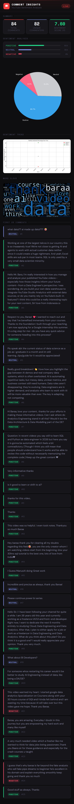
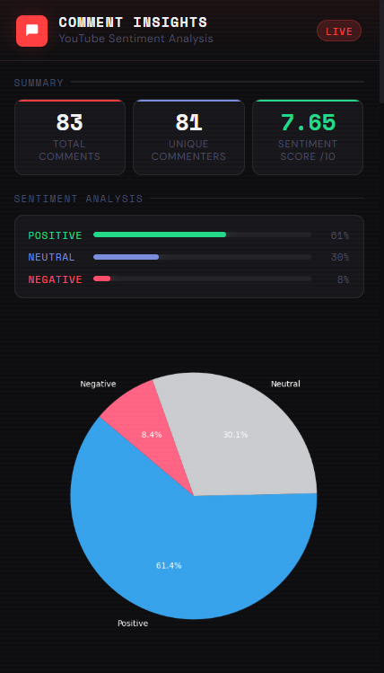
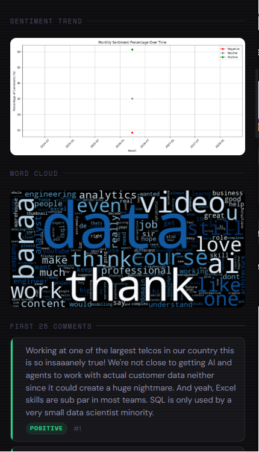
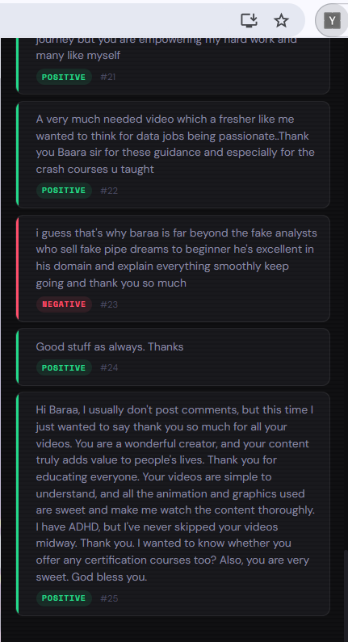
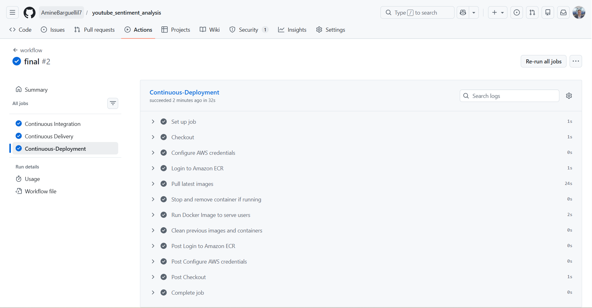
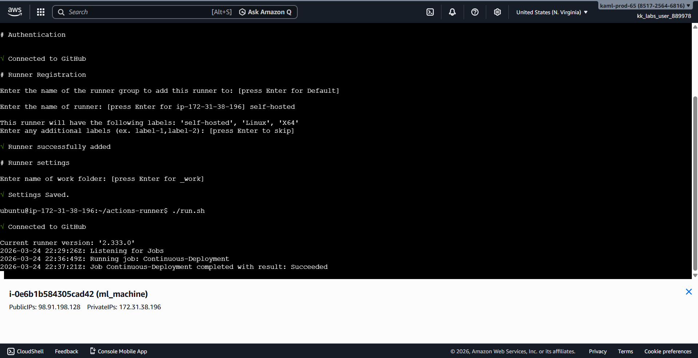

# Youtube-Sentiment-Analysis

## Notebook: Sentiment Analysis on Social Media Comments

The notebook [`notebooks/YouTube_Sentiment_Analysis.ipynb`](notebooks/YouTube_Sentiment_Analysis.ipynb) walks through an end-to-end machine learning pipeline for classifying social media comments as **positive**, **neutral**, or **negative**.

**Data Preprocessing & EDA** — Starting from a raw Reddit comments dataset, the notebook handles missing values, duplicates, empty strings, URL removal, non-English character filtering, lowercasing, stopword removal (preserving sentiment-critical words like *not*, *but*, *no*), and lemmatization. Exploratory Data Analysis includes class distribution, word count distributions (KDE, boxplots) across sentiment categories, stop word frequency analysis, character-level inspection, word clouds per sentiment class, and top-N word frequency charts.

**Experiment Tracking with MLflow** — Experiments are tracked using MLflow hosted on AWS EC2, with artifacts and models stored in an AWS S3 bucket, enabling scalable and reproducible experiment management.

**Modeling & Experimentation** — The notebook follows a structured and iterative experimentation workflow to progressively improve model performance. 
It begins with a baseline model using Random Forest and Bag-of-Words features, followed by a feature engineering comparison between Bag-of-Words and TF-IDF using unigram, bigram, and trigram representations. 
The pipeline then performs feature tuning by adjusting TF-IDF vocabulary size (max_features) to identify the optimal feature space. 
To address dataset imbalance, multiple resampling techniques such as SMOTE, ADASYN, RandomUnderSampler, and SMOTEENN are evaluated using confusion matrices and performance metrics. 
Next, hyperparameter optimization is conducted using Optuna across several models including Random Forest, XGBoost, and LightGBM. 
Finally, a stacking ensemble is implemented to combine the strengths of multiple models and further enhance prediction performance.

**Key tools & libraries** — pandas, scikit-learn, NLTK, imbalanced-learn, LightGBM, XGBoost, Optuna, MLflow, seaborn, matplotlib, WordCloud.

# Setup MLflow on AWS:
Login to AWS console.
Create IAM user with AdministratorAccess
Export the credentials in your AWS CLI by running "aws configure"
Create a s3 bucket
Create EC2 machine (Ubuntu) & add Security groups 5000 port(MLflow Port)

## Run the following commands on EC2 machine:
sudo apt update

sudo apt install python3-pip

sudo apt install pipenv

sudo apt install virtualenv

mkdir mlflow

cd mlflow

pipenv install mlflow

pipenv install awscli

pipenv install boto3

pipenv shell

## Then set aws credentials
aws configure

## Finally 
mlflow server \
-h 0.0.0.0 \
--disable-security-middleware \
--default-artifact-root s3://mlflow-bucket-amine

## MLflow Tracking Server

The MLflow tracking server is hosted on an AWS EC2 instance and can be accessed via:
**http://ec2-54-147-36-34.compute-1.amazonaws.com:5000/**

This allows visualization of experiments, metrics, parameters, and artifacts through the MLflow UI.

## Configure MLflow Tracking URI

Set the MLflow tracking URI to log experiments to the remote server:
**export MLFLOW_TRACKING_URI=http://ec2-54-147-36-34.compute-1.amazonaws.com:5000/**

# ⚙️ Environment Setup

## Create a virtual environment
py -3.11 -m venv comment-analysis  
### Creates a virtual environment named `comment-analysis`

## Activate the virtual environment

### Windows
comment-analysis\Scripts\activate

## Install required dependencies
pip install -r requirements.txt

### This installs all required packages for data preprocessing,
### model training, MLflow experiment tracking, and DVC pipeline execution

# 🔁 DVC (Data Version Control)

## Initialize DVC in the project
dvc init  
### Enables data, model, and pipeline versioning

## Reproduce the ML pipeline
dvc repro  
### Executes the pipeline stages defined in dvc.yaml:
### - Data ingestion (Load raw dataset)
### - Transformation (Clean and preprocess data)
### - Model training (Train ML model)
### - Evaluation (Measure model performance)
### - Model registration (Register model in MLflow Model Registry)

## Visualize the pipeline workflow
dvc dag  
### Displays the Directed Acyclic Graph (DAG) showing
### stage dependencies and pipeline execution order

# 🚀 AWS CI/CD Deployment with GitHub Actions

## 1. Login to AWS Console

Login to your AWS account to start configuring the deployment infrastructure.

## 2. Create IAM User for Deployment with Required Access

Create an IAM user with the following permissions:

### Access Requirements

	1. **EC2 Access** — Used to launch and manage virtual machines  
    2. **ECR Access** — Elastic Container Registry to store Docker images

### Deployment Workflow Description

	1. Build Docker image from source code  
	2. Push Docker image to AWS ECR  
	3. Launch EC2 instance  
	4. Pull Docker image from ECR into EC2  
	5. Launch Docker container on EC2

### Required IAM Policies

	1. `AmazonEC2ContainerRegistryFullAccess`  
	2. `AmazonEC2FullAccess`

	
## 3. Create ECR Repository to Store Docker Image

Create a repository in AWS ECR and save the repository URI: Example:
    - Save the URI: 339713020180.dkr.ecr.us-east-1.amazonaws.com/mlproject

	
## 4. Create EC2 Instance (Ubuntu)

Launch an Ubuntu EC2 instance that will host the deployed Docker container.

## 5. Install Docker on EC2 Machine

	sudo apt-get update -y

	sudo apt-get upgrade

	curl -fsSL https://get.docker.com -o get-docker.sh

	sudo sh get-docker.sh

	sudo usermod -aG docker ubuntu

	newgrp docker
	
## 6. Configure EC2 as Self-Hosted GitHub Runner

GitHub repo → Settings → Actions → Runners → New self-hosted runner → Choose OS →  
Run the generated commands one by one in the EC2 terminal

## 7. Setup GitHub Secrets

GitHub repo → Settings → Secrets and variables → Actions

    AWS_ACCESS_KEY_ID=...

	AWS_SECRET_ACCESS_KEY=...

	AWS_REGION=us-east-1

	AWS_ECR_LOGIN_URI=339713020180.dkr.ecr.us-east-1.amazonaws.com

	ECR_REPOSITORY_NAME=mlproject

# 🚀 Model Deployment Architecture

## Model and Vectorizer Storage (AWS S3)

The trained model (`lgbm_model.pkl`) and TF-IDF vectorizer (`tfidf_vectorizer.pkl`) are uploaded and stored in an AWS S3 bucket:

s3://youtube-sentiment-bucket/

This allows the deployment container to dynamically download the latest model artifacts during runtime.

## Docker Container Runtime Flow

When the GitHub Actions pipeline completes deployment, the Docker container is started on the EC2 instance.  
At container startup, the `start.sh` script executes:
This performs the following steps:

1. Download trained model from AWS S3
2. Download TF-IDF vectorizer from AWS S3
3. Start Flask API serving the model	

# 🔌 Chrome Extension Integration

## Final Deployment Step

After deployment, the Chrome extension uses the EC2 public IP as the API endpoint to perform sentiment analysis.

Example API URL:

**http://100.30.171.39:8080/**

This URL is configured inside the Chrome extension `popup.js`:

**const API_URL = 'http://100.30.171.39:8080/';**

### Configure EC2 Security Group

To allow the Chrome extension to access the deployed API, update the EC2 Security Group inbound rules:

Add a new inbound rule:

Type: Custom TCP  
Port: 8080  
Source: 0.0.0.0/0  

This allows external access to the Flask API running inside the Docker container on port 8080.

Without this rule, the Chrome extension will not be able to communicate with the deployed API.

# Extension Dashboard: Real-time sentiment analysis of YouTube comments.

# Sentiment Distribution Chart: Visual breakdown of positive, neutral, and negative comments.

Visual breakdown of positive, neutral, and negative comments.

# Word Cloud: Most frequent keywords extracted from YouTube comments.

# Comments Analysis: Individual comment classification with sentiment labels.

# 🚀 CI/CD Pipeline: GitHub Actions continuous deployment pipeline successfully deploying to AWS.

# ☁️ AWS Self-Hosted Runner: Self-hosted GitHub runner configured on AWS EC2 instance.

